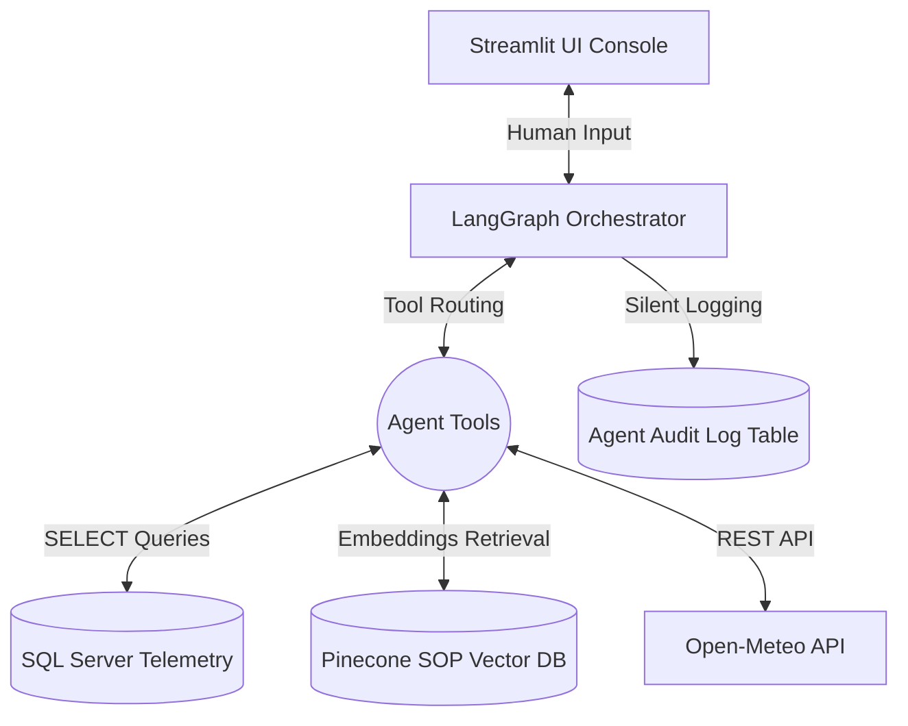

# 🧊 Cold-Chain Logistics FDE - AI Orchestration Platform


## 📖 Overview
The **Cold-Chain Logistics Forward Deployed Engineering (FDE)** project is an AI-powered enterprise orchestration platform. It allows dispatchers and logistics operators to query real-time fleet telemetry, analyze weather corridors, and instantly retrieve compliance protocols using a stateful LangGraph-powered conversational agent.

By combining Google Gemini (or local LLMs) with SQL telemetry and vector databases, this platform ensures that all cold-chain shipments adhere strictly to Standard Operating Procedures (SOPs).

## ✨ Key Features
- **LangGraph Agent Orchestration**: Stateful, multi-agent reasoning loops.
- **SQL Telemetry Integration**: Real-time querying of active fleet GPS and cargo temperature data.
- **Live Environmental Hazards**: Real-time weather and corridor risk assessment via REST APIs.
- **Vector Compliance Search**: Instant retrieval of compliance thresholds via Pinecone Vector Store.
- **Secure Audit Trails**: Silent, automated logging of every AI decision and tool execution into SQL Server.
- **Enterprise Dashboard**: A sleek, dark-mode Streamlit UI for Dispatch Operations and Security Auditing.

## 🏗️ System Architecture


## 🚀 Getting Started

### 1. Prerequisites
- Python 3.12+
- Microsoft SQL Server (or Docker MSSQL container)
- Access to Google Gemini API
- Access to Pinecone API

### 2. Installation
Clone the repository and set up a virtual environment:
```bash
git clone https://github.com/your-org/Cold-Chain-Logistics-FDE-Project.git
cd Cold-Chain-Logistics-FDE-Project
python -m venv .venv
.venv\Scripts\activate
pip install -r requirements.txt
```

### 3. Environment Configuration
Create a `.env` file in the root directory based on `.env.example`:
```env
# AI Models
AGENT_LLM=GEMINI
GOOGLE_API_KEY=your_gemini_key

# Database
SQL_SERVER_HOST=localhost
SQL_SERVER_PORT=1433
SQL_AGENT_USER=USR_FDE_RO
SQL_AGENT_PASSWORD=your_password
SQL_ADMIN_USER=sa
SQL_ADMIN_PASSWORD=your_admin_password

# Vector DB
PINECONE_API_KEY=your_pinecone_key
```

### 4. Database Initialization
Ensure your database has the proper schemas and security roles set up:
```bash
# Ingest historical fleet data
python scripts/ingest_legacy_data.py

# Ingest SOP documents into Pinecone
python scripts/ingest_sop_pinecone.py
```
*(Also ensure you run the `scripts/setup_security_and_view.sql` and the Audit Log table scripts via your SQL client).*

## 💻 Running the Application

### Option A: CLI Interactive Mode
To run the lightweight chat loop in your terminal:
```bash
python src/orchestrator.py
```

### Option B: Enterprise Web Dashboard
To launch the full Streamlit UI interface:
```bash
streamlit run src/ui.py
```

## 💡 Sample Dispatcher Queries & Scenarios

You can test the agent in the interactive UI or CLI using these sample operational scenarios:

### 1. 🚨 Temperature Breach & Anomaly Analysis (Full Tri-Tool Flow)
> *"Check the fleet for any active temperature breaches or high-risk cargo anomalies. What are the corridor weather conditions at those locations, and what actions are required under our SOP?"*
- **Triggers**: `query_telemetry_db` → `fetch_corridor_conditions` → `search_compliance_sop`

### 2. 🚛 Port Congestion & Rerouting Protocol
> *"Are there any shipments experiencing severe port congestion (>7.0)? What is our mandatory diversion protocol according to the SOP?"*
- **Triggers**: `query_telemetry_db` (checks `Port_Congestion_Level`) → `search_compliance_sop` (Inland Empire Depot diversion rule)

### 3. ⚠️ High-Risk Delay Escalation
> *"Show me all shipments classified as High Risk with delay probability greater than 60%. What escalation steps are required?"*
- **Triggers**: `query_telemetry_db` (filters `Risk_Classification` and `Delay_Probability`) → `search_compliance_sop` (Tier 2 Escalation protocol)

### 4. 🌤️ Real-Time GPS Corridor Weather
> *"What are the current external weather conditions and transit risks for a truck near latitude 34.05, longitude -118.25?"*
- **Triggers**: `fetch_corridor_conditions` (queries Open-Meteo REST API)

### 5. 🔍 SOP Regulatory Search
> *"What is the standard operating protocol if refrigerated fresh perishables cargo temperature exceeds 4.0°C?"*
- **Triggers**: `search_compliance_sop` (retrieves Section 1 Temperature Breach mitigation)

## 📁 Repository Structure
- `/data/` - Source compliance SOP documents and raw legacy files.
- `/docs/` - System architecture instructions and phase planning.
- `/scripts/` - Database ingestion and setup scripts.
- `/src/` - Core application logic, LangGraph orchestrator, and UI.
- `/src/prompts/` - Externalized system prompts and AI behavioral guidelines.

